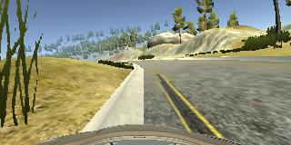
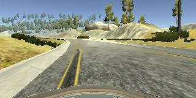
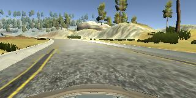
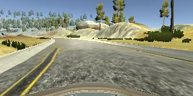
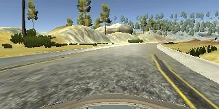

# **Behavioral Cloning** 

## Writeup Template

### You can use this file as a template for your writeup if you want to submit it as a markdown file, but feel free to use some other method and submit a pdf if you prefer.

---

**Behavioral Cloning Project**

The goals / steps of this project are the following:
* Use the simulator to collect data of good driving behavior
* Build, a convolution neural network in Keras that predicts steering angles from images
* Train and validate the model with a training and validation set
* Test that the model successfully drives around track one without leaving the road
* Summarize the results with a written report


## Rubric Points
### Here I will consider the [rubric points](https://review.udacity.com/#!/rubrics/432/view) individually and describe how I addressed each point in my implementation.  

---
### Files Submitted & Code Quality

#### 1. Submission includes all required files and can be used to run the simulator in autonomous mode

My project includes the following files:
* model.py containing the script to create and train the model
* drive.py for driving the car in autonomous mode
* model.h5 containing a trained convolution neural network 
* writeup_report.md or writeup_report.pdf summarizing the results

#### 2. Submission includes functional code
Using the Udacity provided simulator and my drive.py file, the car can be driven autonomously around the track by executing 
```sh
python drive.py model.h5
```

#### 3. Submission code is usable and readable

The model.py file contains the code for training and saving the convolution neural network. The file shows the pipeline I used for training and validating the model, and it contains comments to explain how the code works.

### Model Architecture and Training Strategy

#### 1. An appropriate model architecture has been employed

My model consists of three layers of convolution neural networks with 5x5 filter sizes with depths of 24, 36, 48. These layers then followed by two layers of convolution neural networks with 3×3 filter sizes with depths of 64. All convolution neural network layers utilizes RELU layers to introduce nonlinearity (model.py line 76-80), and the data is normalized in the model using a Keras lambda layer (code line 72). 

#### 2. Attempts to reduce overfitting in the model

The model contains dropout layers in order to reduce overfitting (model.py lines 81). 

The model was trained and validated on different data sets to ensure that the model was not overfitting (model.py line 103 with the generator definition starts at line 27). The model was tested by running it through the simulator and ensuring that the vehicle could stay on the track.

#### 3. Model parameter tuning

The model used an adam optimizer, so the learning rate was not tuned manually (model.py line 100).

#### 4. Appropriate training data

I actually used the training data provided by the coruse program under the data folder. Training data can be chosen to keep the vehicle driving on the road. For example, combination of center lane driving, recovering from the left and right sides of the road, and multiple smooth drinving at the curves should be provided for training.

### Model Architecture and Training Strategy

#### 1. Solution Design Approach

The overall strategy for deriving a model architecture was to utilize some existing model architecture and adopt it to my project. I ended up using the architecture developed by [Nvidia group](https://developer.nvidia.com/blog/deep-learning-self-driving-cars/). 

In order to gauge how well the model was working, I split my image and steering angle data into a training and validation set (80% training and 20% validation). I found that my first model had a low mean squared error on the training set but a high mean squared error on the validation set. This implied that the model was overfitting. 

To combat the overfitting, I modified the model by adding a dropout layer of 0.2 drop out rate right after the last convolutional layer to overcome the overfitting issue.

The error looks more promising after the dropout layer was added.

The final step was to run the simulator to see how well the car was driving around track one. Overall, it performs well. The vehicle is able to drive autonomously around the track without leaving the road.

#### 2. Final Model Architecture

The final model architecture (model.py lines 69-87) consisted of a convolution neural network with the following layers and layer sizes:
_________________________________________________________________
Layer (type)                 Output Shape              Param #   
=================================================================
lambda_1 (Lambda)            (None, 160, 320, 3)       0         
_________________________________________________________________
cropping2d_1 (Cropping2D)    (None, 65, 320, 3)        0         
_________________________________________________________________
conv2d_1 (Conv2D)            (None, 31, 158, 24)       1824      
_________________________________________________________________
conv2d_2 (Conv2D)            (None, 14, 77, 36)        21636     
_________________________________________________________________
conv2d_3 (Conv2D)            (None, 5, 37, 48)         43248     
_________________________________________________________________
conv2d_4 (Conv2D)            (None, 3, 35, 64)         27712     
_________________________________________________________________
conv2d_5 (Conv2D)            (None, 1, 33, 64)         36928     
_________________________________________________________________
dropout_1 (Dropout)          (None, 1, 33, 64)         0         
_________________________________________________________________
flatten_1 (Flatten)          (None, 2112)              0         
_________________________________________________________________
dense_1 (Dense)              (None, 100)               211300    
_________________________________________________________________
dense_2 (Dense)              (None, 50)                5050      
_________________________________________________________________
dense_3 (Dense)              (None, 10)                510       
_________________________________________________________________
dense_4 (Dense)              (None, 1)                 11        
=================================================================
Total params: 348,219
Trainable params: 348,219
Non-trainable params: 0
_________________________________________________________________


#### 3. Creation of the Training Set & Training Process

The simulator was not running smoothly on my computer, so I decided to use the dataset provided by the course under the directory of "/opt/carnd_p3/data/" for the normal laps data. 

To capture good driving behavior, I additionally recorded the vehicle recovering from the left side and right sides of the road back to center so that the vehicle would learn to recover when deviated from the center of the lane. These images show what a recovery looks like starting from the left shoulder:





To augment the data sat, I also flipped images and angles thinking that this would increase the dataset as well as remove the left-lean trend due to the first track's natural as a loop. For example, here is an image that has then been flipped:




After the collection process, I had 51320 number of images. I then preprocessed these images by crop the top 70 rows and bottom 25 rows of pixels (model.py lines 74).

I finally randomly shuffled the data set and put 20% of the data into a validation set. (model.py lines 90)

I used this training data for training the model. The validation set helped determine if the model was over or under fitting. The ideal number of epochs was 3 since the loss actually increased after 3 epochs. I used an adam optimizer so that manually training the learning rate wasn't necessary.
